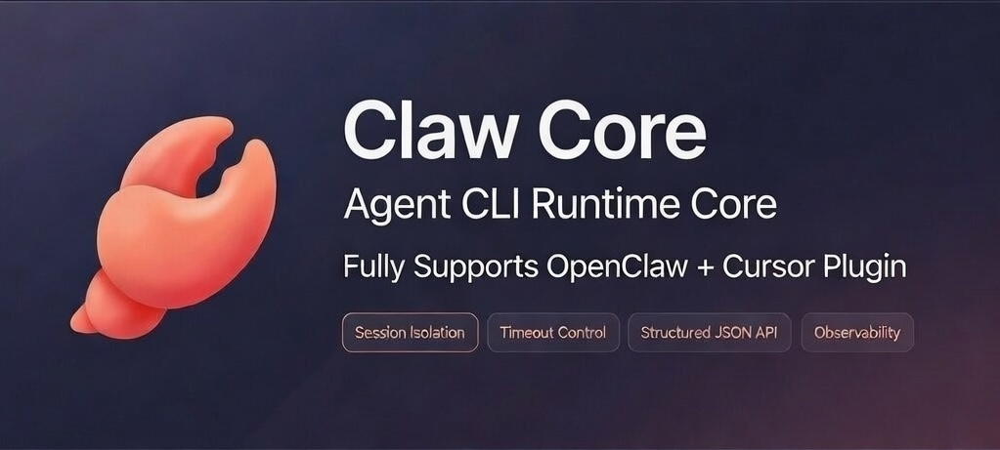

# Claw Core（繁體中文）

[](https://www.rust-lang.org/)

[](LICENSE)



Agent CLI 執行運行時：穩定、可控、可觀測的命令執行核心。

完全支援 OpenClaw，並提供用於 OpenClaw 工作流程的 Cursor 外掛整合（`plugin/`）。

---

## What（是什麼）

Claw Core 是 AI 代理與作業系統進程之間的 Rust 運行時層。  
代理透過 JSON 協定呼叫 Claw Core，而不是直接 `exec`。

```text
Agent / Gateway  -->  Claw Core (JSON API)  -->  OS processes
```

---

## Why（為什麼）

讓代理直接執行系統命令，在實務上常見不穩定、不可控、難除錯。  
Claw Core 以一致的執行模型處理這些風險。

---

## 解決的問題

- **失控進程**：命令/會話逾時與清理
- **會話混亂**：明確生命週期與隔離邊界
- **回應不一致**：標準化 JSON 回傳
- **可觀測性不足**：運行時統計與健康檢查
- **密鑰風險**：環境變數透傳，不落碟
- **OpenClaw 串接複雜**：透過 Cursor 外掛直接接入 OpenClaw 真實工作流程

---

## How（如何運作）

1. 代理送出 JSON 請求（`system.ping`、`session.*`、`exec.run`、`system.stats`）
2. Claw Core 驗證並分派至對應模組
3. 執行器依逾時策略執行並收集輸出
4. 回傳結構化結果給呼叫方

---

## 快速開始

### 前置需求

- Rust stable
- `socat`（本機 socket 探測）

### 啟動

```bash
cargo run -- --socket-path /tmp/trl.sock
```

### 探測

```bash
echo '{"id":"1","method":"system.ping","params":{}}' | socat - UNIX-CONNECT:/tmp/trl.sock
```

### 測試

```bash
cargo test
./scripts/smoke.sh
```

### 推送前檢查

執行 pre-push 腳本驗證核心運行時與 release 構建：

```bash
./scripts/pre-push-test.sh
```

若已安裝 OpenClaw，可加 `--openclaw` 驗證外掛整合：

```bash
./scripts/pre-push-test.sh --openclaw
```

---

## Build 與 Deploy

### 本機建置

```bash
cargo build --release
```

### 版本發布

工作流：`.github/workflows/release.yml`

觸發條件：

- 推送 `v*` 標籤（例如 `v0.1.0`）

產物平台：

- Linux `x86_64` / `aarch64`
- macOS `x86_64` / `aarch64`

**說明：** 暫不支援 Windows（claw_core 使用 Unix domain socket、rlimit 等 Unix 專屬 API）。

---

## 版本策略

- 目前版本：`0.1.0`
- 發布以 git tag `v*` 為準

建議流程：

1. 更新 `Cargo.toml` 版本
2. commit
3. 打並推送 tag：`git tag v0.1.0 && git push origin v0.1.0`
4. 自動產出發布包

---

## 專案結構（Core）

```text
claw/
├── src/                   # runtime 實作
├── tests/                 # 單元/整合測試
├── scripts/               # smoke 與輔助腳本
├── plugin/                # 用於 OpenClaw 的 Cursor 外掛整合
├── .github/workflows/     # CI 與發布流程
├── README.md
├── README-zh-Hans.md
└── README-zh-Hant.md
```

---

## 參考

- [外掛說明](plugin/README.md)
- [Pre-push 測試](scripts/pre-push-test.sh)
- [整合驗證](scripts/verify_integration.sh)
- [安裝腳本](scripts/install-from-release.sh)
