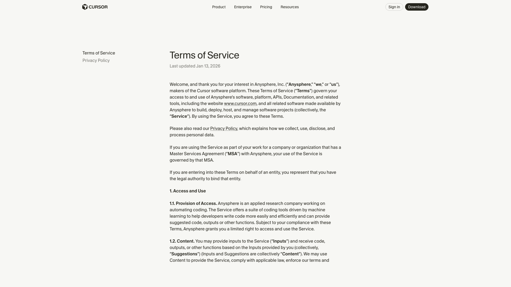

# Claw Core

[](https://www.rust-lang.org/)

[](LICENSE)

[简体中文](README-zh-Hans.md) | [繁體中文](README-zh-Hant.md)


Agent CLI execution runtime for stable, controlled, and observable command automation.

Fully supports OpenClaw and provides a Cursor plugin integration (`plugin/`) for OpenClaw workflows. Tested with OpenClaw 2026.2.13 and Cursor IDE 2.5.11 — see [plugin README](plugin/README.md#compatibility) for details.

> **CLI integration status:** Cursor CLI and Codex CLI integrations are functional but not yet fully integrated. Kilo Code has not been run or tested yet. See the [plugin README](plugin/README.md) for current status.
>
> The plugin wraps the Cursor CLI as a local subprocess — this is permitted under Cursor's Terms of Service (§1.5, §6). Screenshot of the ToS (last updated Jan 13, 2026): [`assets/images/cursor-tos-screenshot.png`](assets/images/cursor-tos-screenshot.png)



---

## What

Claw Core is a Rust runtime that sits between AI agents and OS process execution.
Agents call Claw Core through JSON protocol instead of using direct `exec`.

```text
Agent / Gateway  -->  Claw Core (JSON API)  -->  OS processes
```

---

## Why

Direct process execution from agents is often fragile in production.
Claw Core standardizes runtime behavior and reduces operational risk.

---

## Problems Claw Core Solves

| Problem | What Claw Core Does |
|---|---|
| Runaway process control | Command and session timeout with automatic cleanup |
| Session isolation | Explicit session lifecycle and boundaries |
| Unstructured execution results | Normalized JSON responses for every call |
| Low observability | Runtime stats endpoint for health checks |
| Secret leakage risk | Env pass-through without persistence |
| OpenClaw runtime wiring | Direct Cursor plugin-based integration for real OpenClaw workflows |

---

## How It Works

| Step | Description |
|---|---|
| 1 | Agent sends JSON request (`system.ping`, `session.*`, `exec.run`, `system.stats`) |
| 2 | Claw Core validates and dispatches to session/executor modules |
| 3 | Runtime executes command with timeout and captures outputs |
| 4 | Claw Core returns structured response to caller |

---

## Quick Start

### Prerequisites

| Requirement | Notes |
|---|---|
| Rust stable | `rustup toolchain install stable` |
| `socat` | For local socket probe |

### Run

```bash
cargo run -- --socket-path /tmp/trl.sock
```

### Ping Probe

```bash
echo '{"id":"1","method":"system.ping","params":{}}' | socat - UNIX-CONNECT:/tmp/trl.sock
```

### Test

```bash
cargo test
./scripts/smoke.sh
```

### Before Pushing

Run the pre-push script to validate core runtime and release build:

```bash
./scripts/pre-push-test.sh
```

With OpenClaw installed, add `--openclaw` to also verify plugin integration:

```bash
./scripts/pre-push-test.sh --openclaw
```

See [verify_integration.sh](scripts/verify_integration.sh) and [plugin README](plugin/README.md) for OpenClaw setup (clear config, install from local path). One-command install: `openclaw plugins install @wchklaus97hk/claw-core` — the daemon auto-downloads the binary on first start (OpenClaw does not run npm postinstall).

---

## Build and Deploy

### Local Build

```bash
cargo build --release
```

### Binary Release

| Platform | Architectures |
|---|---|
| Linux | `x86_64`, `aarch64` |
| macOS | `x86_64`, `aarch64` |
| Windows | Not supported (Unix domain sockets, `rlimit`, Unix-only APIs) |

Release workflow: `.github/workflows/release.yml` — trigger by pushing a `v*` tag (e.g. `v0.1.0`).

---

## Versioning

Current crate version: `0.1.0` — release source of truth is the git tag `v*`.

Recommended flow:

1. Update `Cargo.toml` version
2. Commit
3. Create and push tag: `git tag v0.1.0 && git push origin v0.1.0`
4. Release workflow publishes archives

---

## Project Layout

```text
claw/
├── src/                   # runtime implementation
├── tests/                 # integration/unit tests
├── scripts/               # smoke/install/helper scripts
├── plugin/                # Cursor plugin integration for OpenClaw
├── .github/workflows/     # CI and release workflows
├── README.md
├── README-zh-Hans.md
└── README-zh-Hant.md
```

---

## Testing

### 1. Plugin Installation & Setup

| # | Test | Command | Expected |
|---|------|---------|----------|
| 1.1 | Install from npm | `openclaw plugins install @wchklaus97hk/claw-core` | Plugin extracted, no errors |
| 1.2 | Plugin loaded | `openclaw clawcore status` | Shows plugin path and status |
| 1.3 | Skills installed | `ls ~/.openclaw/skills/` | Skills present |
| 1.4 | Uninstall | `openclaw plugins uninstall @wchklaus97hk/claw-core` | Clean removal |

### 2. Daemon Lifecycle

| # | Test | Command / Telegram | Expected |
|---|------|-------------------|----------|
| 2.1 | Start daemon | `openclaw clawcore start` | PID file at `/tmp/claw_core.pid`, socket at `/tmp/trl.sock` |
| 2.2 | Status check | `openclaw clawcore status` | Running, shows PID |
| 2.3 | Ping probe | `echo '{"id":"1","method":"system.ping","params":{}}' \| socat - UNIX-CONNECT:/tmp/trl.sock` | `"pong"` response |
| 2.4 | Restart | `openclaw clawcore restart` | New PID, socket alive |
| 2.5 | Stop | `openclaw clawcore stop` | PID file removed, socket gone |
| 2.6 | Auto-start (boot hook) | `openclaw gateway restart` | Daemon starts automatically |
| 2.7 | **Telegram** | `clawcore status` | Bot replies with daemon status |
| 2.8 | **Telegram** | `start the claw_core daemon` | Bot starts daemon, confirms |

### 3. Workspace Setup

| # | Test | Command / Telegram | Expected |
|---|------|-------------------|----------|
| 3.1 | Init workspace | `openclaw clawcore init-workspace` | Creates `~/Documents/claw_core/` with shared_memory, shared_skills, generated/ |
| 3.2 | Verify structure | `ls ~/Documents/claw_core/` | `shared_memory/`, `shared_skills/`, `projects/`, `generated/images/`, `generated/exports/` |
| 3.3 | Setup Cursor | `openclaw clawcore setup-cursor` | Updates `openclaw.json` with cliBackends, cursor-dev agent |
| 3.4 | Custom workspace | `openclaw clawcore setup-cursor --workspace /tmp/test-ws` | Workspace created at custom path |
| 3.5 | Reset workspace | `openclaw clawcore reset-workspace` | Resets workspace, backs up shared_memory |
| 3.6 | **Telegram** | `set up the Cursor integration` | Bot runs setup-cursor, confirms |
| 3.7 | **Telegram** | `initialize my workspace` | Bot creates workspace, lists contents |

### 4. Command Execution (exec.run)

| # | Test | Command / Telegram | Expected |
|---|------|-------------------|----------|
| 4.1 | Simple command | `echo '{"id":"2","method":"exec.run","params":{"session_id":"...","command":"echo hello"}}' \| socat - UNIX-CONNECT:/tmp/trl.sock` | `stdout: "hello\n"`, exit_code 0 |
| 4.2 | Timeout | exec.run with `timeout_s: 2` and `sleep 10` | Timeout error |
| 4.3 | Env passthrough | exec.run with `env: {"FOO":"bar"}` and `echo $FOO` | `stdout: "bar\n"` |
| 4.4 | **Telegram** | `run the command: echo "hello from claw_core"` | Bot executes via claw_core, returns output |
| 4.5 | **Telegram** | `run: ls -la ~/Documents/claw_core/` | Returns workspace listing |

### 5. Session Management

| # | Test | Command / Telegram | Expected |
|---|------|-------------------|----------|
| 5.1 | Create session | `session.create` RPC | Returns session_id |
| 5.2 | List sessions | `session.list` RPC | Shows active sessions |
| 5.3 | Session info | `session.info` RPC | Returns session details |
| 5.4 | Destroy session | `session.destroy` RPC | Session removed |
| 5.5 | **Telegram** | `list active claw_core sessions` | Bot returns session list |
| 5.6 | **Telegram** | `clean up all sessions` | Bot destroys idle sessions |

### 6. Cursor Agent Integration

| # | Test | Command / Telegram | Expected |
|---|------|-------------------|----------|
| 6.1 | Direct invoke | `cursor_agent_direct` tool call | Cursor agent runs task in workspace |
| 6.2 | Plan mode | `cursor-plan` backend | Cursor responds in plan mode |
| 6.3 | Ask mode | `cursor-ask` backend | Cursor responds in ask mode |
| 6.4 | **Telegram** | `ask Cursor to explain what claw_core does` | Bot invokes cursor_agent_direct, returns answer |
| 6.5 | **Telegram** | `use Cursor to write a hello world Python script` | Bot invokes Cursor, file created in workspace |

### 7. Codex Agent Integration

| # | Test | Command / Telegram | Expected |
|---|------|-------------------|----------|
| 7.1 | Check install | `python3 plugin/scripts/codex_agent_direct.py --check` | Returns installed + version |
| 7.2 | Direct invoke | `codex_agent_direct` tool call | Codex runs task in workspace |
| 7.3 | Model override | tool call with `model: gpt-4.1` | Uses specified model |
| 7.4 | Ask mode | tool call with `mode: ask` | Read-only, no file writes |
| 7.5 | **Telegram** | `use Codex to write a hello world Python script` | Bot invokes codex_agent_direct, file created |
| 7.6 | **Telegram** | `ask Codex to explain what claw_core does` | Bot invokes Codex in ask mode, returns answer |

### 8. Skills Verification

| # | Test | Command / Telegram | Expected |
|---|------|-------------------|----------|
| 8.1 | Skills present | `ls ~/.openclaw/skills/ \| wc -l` | 20 skills |
| 8.2 | Core runtime skill | `cat ~/.openclaw/skills/claw-core-runtime/SKILL.md` | Skill file exists |
| 8.3 | Daemon skill | **Telegram**: `use the claw-core-daemon skill to check status` | Bot reads skill, checks daemon |
| 8.4 | Cron helper | **Telegram**: `schedule a reminder in 30 minutes: take a break` | cron-helper creates job |
| 8.5 | Status dashboard | **Telegram**: `show me the status dashboard` | Returns system overview |

### 9. Agent Teams & Multi-Bot

> **Not yet tested.** These tests require 3 Telegram bots and a configured group. Run after section 8 passes.

| # | Test | Command / Telegram | Expected |
|---|------|-------------------|----------|
| 9.1 | Setup bots | `openclaw clawcore setup-bots` | 3 Telegram bots configured (artist, assistant, developer) |
| 9.2 | Team create | `openclaw clawcore team create my-team` | Team created |
| 9.3 | Team list | `openclaw clawcore team list` | Shows teams |
| 9.4 | Setup Telegram group | `openclaw clawcore team setup-telegram` | Group configured |
| 9.5 | **Telegram (developer bot)** | `write a Rust function that reverses a string` | Developer bot delegates to Cursor, returns code |
| 9.6 | **Telegram (assistant bot)** | `what's the weather in Hong Kong?` | Assistant bot responds with info |
| 9.7 | **Telegram (team group)** | `coordinate: developer writes the code, assistant reviews it` | team_coordinate dispatches tasks |

---

## References

| Resource | Link |
|---|---|
| Plugin README | [plugin/README.md](plugin/README.md) |
| Pre-push test | [scripts/pre-push-test.sh](scripts/pre-push-test.sh) |
| Integration verification | [scripts/verify_integration.sh](scripts/verify_integration.sh) |
| Install OpenClaw plugin | [scripts/install-claw-core-openclaw.sh](scripts/install-claw-core-openclaw.sh) |
| Remove OpenClaw plugin | [scripts/remove-claw-core-openclaw.sh](scripts/remove-claw-core-openclaw.sh) |
| Install binary from release | [scripts/install-from-release.sh](scripts/install-from-release.sh) |

---

## License

MIT
